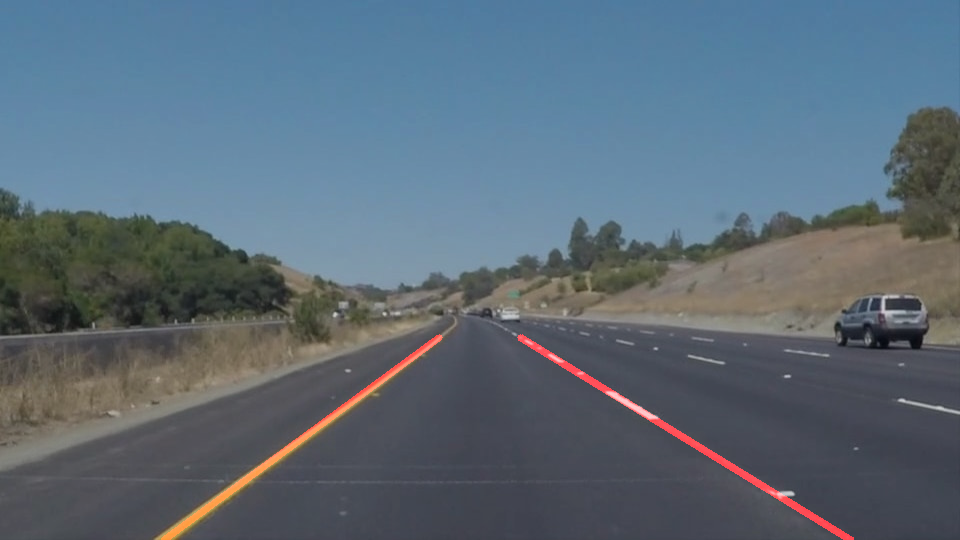
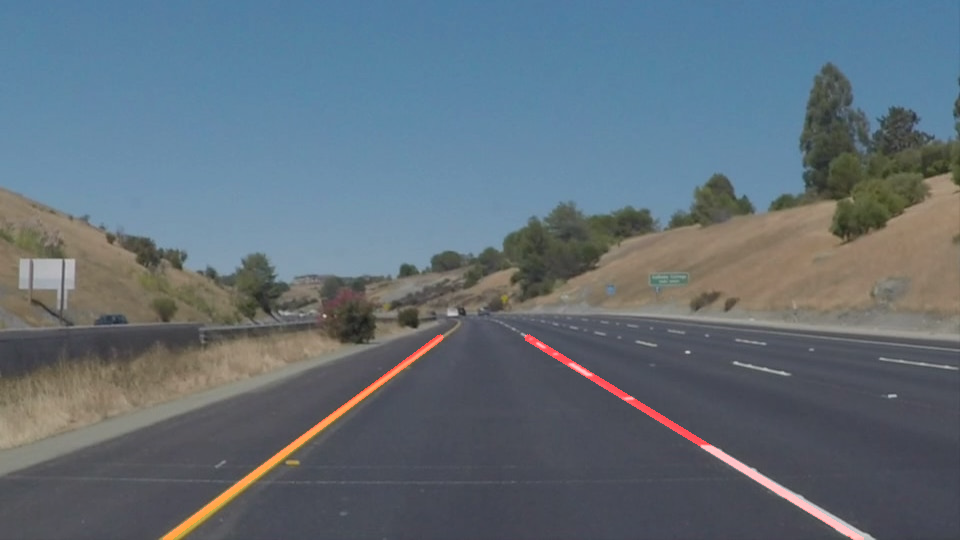
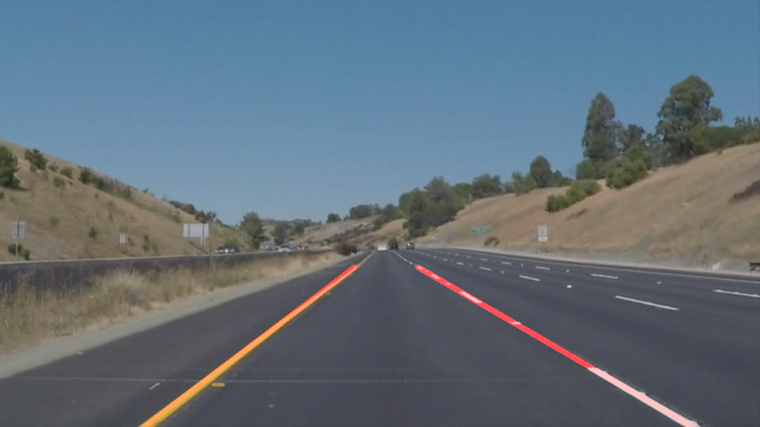

# **Finding Lane Lines on the Road** 

## Writeup

---

**Finding Lane Lines on the Road**

The goals / steps of this project are the following:
* Make a pipeline that finds lane lines on the road
* Reflect on your work in a written report

---

### Reflection

### 1. pipeline.

My pipeline consisted of the following steps:
* Converting image to grayscale
* Applying Gaussian blur. Before runing Canny edge detector, The Gaussian smoothing is essentially way of suppressing noise and spurious gradients by averaging. We can choose the kernel_size for smoothing. A larger kernel_size implies averaging, or smoothing, over a large area. In this pipline, the kernel_size is 3.
* Edge detection. Canny edge detector was used to find the edgs of the lane lines in an image with low threshold = 50, high threshold = 150.
* Region Masking. In this case, we assume that the front facing camera that took the image is mounted in a fixed position on the car, such that the lane lines will alway appear in the same general region of the image. We will take advantage of the this by adding a criterion to only consider the detected lines in the region where we expect to find the lane lines.
* Line detection with Hough Transform
* Draw left and right lane lines. The final step is overlaying the left and right lane lines to original image.

In order to draw a single line on the left and right lanes, the draw_lines() function was modified. Based on detected lane line segments, its slope was used to classify the line segment belong to which, left / right side, lane line. The numpy.polyfit() is used to find the single lane line. In order to better approximation of the line, no. of rules are empolyed to filter out invalid line segments. They are:
* filter out vertical / horizontial lines
* slope should be < -0.4 for left lane / >0.4 for right lane
* assume that left lane in left half area of image/ right lane in right half area of image
In addition, in order to reduce the effect of outlier data points during line fitting, instead of start/end point, no. of intermediate data points will be added also based on the length of the line segment.

The following images show how the pipeline works

The results of the test images are:

### 2. Identify potential shortcomings with your current pipeline

One potential shortcoming would be traffic jam case, other cars may block the camera view and this pipline is no way to find the lane.

### 3. Suggest possible improvements to your pipeline

A possible improvement would use the 2nd order polyfit to interpolate the lane lines.
